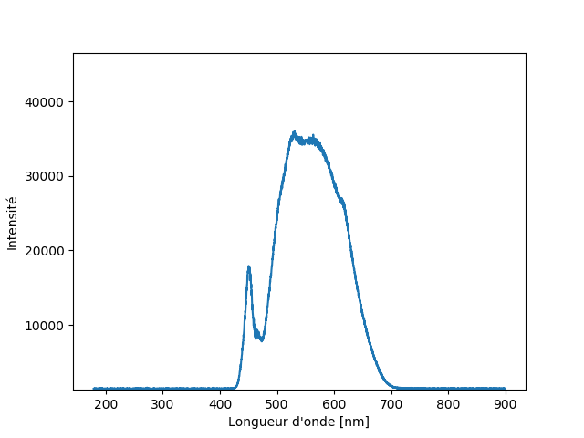

# Lab Notes

### 13 Novembre 2019

- On réinstalle le setup.
- Alimentation de la LED à l'aide du fil USB. 
- On place le positif sur le plus petit contact de la smLED.
- Test software
- Acquisition du spectre de la LED

### 20 Novembre 2019

- Souder la LED et l'alimentation.
- Packager un peu le tout.
- Noter les dimensions du setup. 
- Prendre une/des photos pour Guillaume

Recontacter Guillaume pour obtenir un varivent.

Possibilité de connecter à un ordi ? ou de laisser un ordi sur place ?