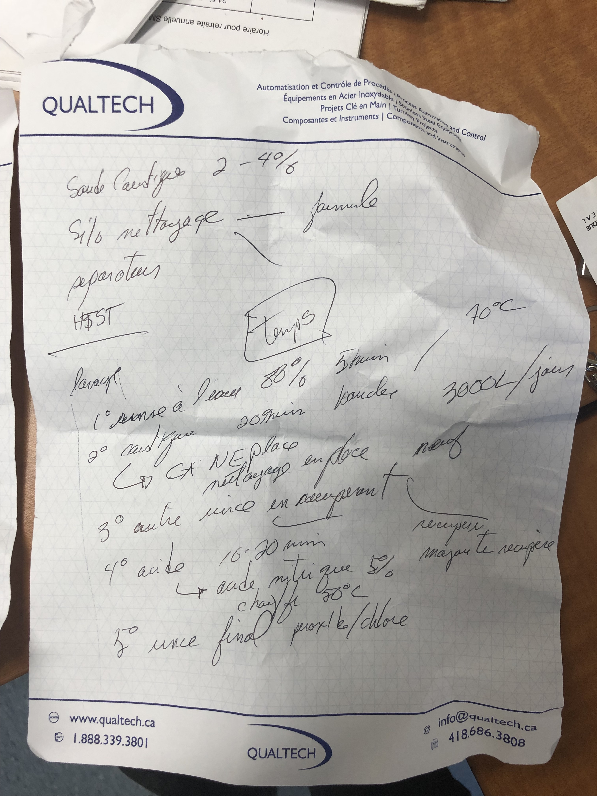
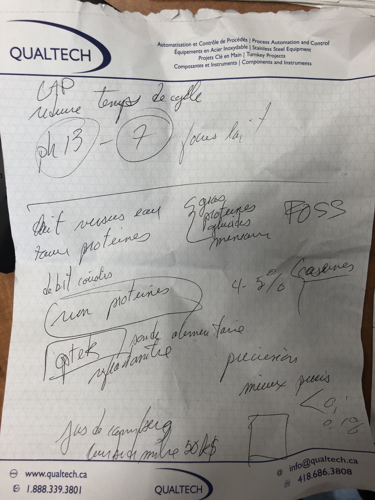

# Meeting Qualtech 21 fev

## But: premier contact

**Date**: Jeudi 21 Février

**Présents:** Sebastien, Ludovick, Daniel, Guillaume et Nicolas Giguere de Qualtech

## Discussion

Le nettoyage et la production,nous avons vu des sondes commerciales.

Les appareils deoivent etre sans "angles droits" pour eviter accumulation bacteries.

## Etapes du nettoyage

Nettoyage: Soude caustique (NaOH) 2-4%

1. Rinçage a l'eau 5 mins, fait 80% du travail.
2. Caustique, 20 minutes, en boucle: solution réutilisée est turbide dû à la reutilisation
3. Autre rinçage en place, en recuperant la caustique
4. Acide nitrique, 5%, 50 deg C 20 mins
5. Rincage final peroxide ou chlore

**A savoir: Le nettoyage est le facteur limitant en production: quand on lave, on produit pas.** Le cycle de caustique pourrait etre reduit si on savait que c'est propre. On ne prend pas de chance, 20 minutes tout le temps.

## Monitoring en place

Dans les tuyaux, il y a: gras proteines glucides, minéraux. Savoir la quantité de protéines utile pour optimiser le processus.

1. Plusieurs méthodes pour le gras avec des debit metre de Coriolis.

2. Pas de méthodes pour bien mesurer les proteines, surtout des caséines (?)
3. Joeur sur le marché Optek, FOSS
4. Précision demandée probablement de l'ordre de 0.1%, certainement pas 1%.
5. Pour glucides: refractometre (mesure l'indice de refraction)

**A savoir: le taux de proteines en ligne dans les tuyaux.**

