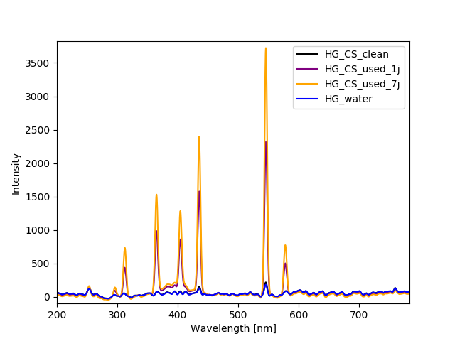

# Suivi du sous-projet 1: Nettoyage des conduits

#### Résumé exécutif

Le but du projet consiste à démontrer la faisabilité d'un système optique permettant de discriminer les différentes solutions présentes dans le processus de nettoyage. Pour cela, la diffusion de la lumière visible a été observée sur les différents échantillons fournis, soit de l'eau, de la caustique propre, et de la caustique utilisée 1 jour et 7 jours. À l'aide de ce simple système, il est possible de différencier les degrés de salissage de la caustique, sans toutefois différencier la caustique propre de l'eau. Les données ont seulement été recueillies sur des échantillons statiques, alors qu'une solution hétérogène en mouvement fournirait nécessairement plus d'informations.

On trouve alors pertinent d'intégrer le plus tôt possible un système afin de collecter des données dans une usine. Il sera alors intéressant d'analyser les données avec les logs du nettoyage pour voir si un tel système peut performer. 

### But

Reconnaître la composition du mélange présent à l'intérieur des conduits en temps réel afin de mieux identifier les différentes phases du nettoyage et ainsi optimiser le processus.

### Description

##### Etapes du nettoyage

1. Rinçage à l'eau 5 mins, fait 80% du travail.
2. Caustique, 20 minutes, en boucle: solution turbide dû à la réutilisation.
3. Autre rinçage en place, en récupérant la caustique.
4. Acide nitrique, 5%, 50 deg C, 20 mins.
5. Rinçage final peroxide ou chlore.

##### Remarques

- Soude caustique (NaOH) 2-4%

- La caustique est réutilisée pour quelques nettoyages. Il est alors inutile de détecter le degré absolu de salubrité de la caustique, il faut plutôt s'intéresser à la différence entre l'entrée et la sortie des conduits (donc 2 capteurs) afin de voir si la caustique opère toujours.
- **Le nettoyage est le facteur limitant en production: quand on lave, on ne produit pas.** Le cycle de caustique pourrait être réduit si on savait que c'est propre. Pour l'instant on ne prend pas de chance: 20 minutes tout le temps.

### Cahier des charges

$\Delta P_C$: Différence de propreté minimale de la caustique pour considérer un nettoyage actif.  

| CHARGES                                                      | CONTRAINTES         |
| :----------------------------------------------------------- | ------------------- |
| **Déterminer la composition du mélange**                     |                     |
| Précision sur la concentration en caustique (par rapport à l'eau et au lait) | < 1% ?              |
| Précision sur la différence en diffusion de deux spectres de caustique | < $\Delta P_C/2$    |
| **Acquérir les données en temps réel**                       |                     |
| Fréquence d'acquisition                                      | \> 5 Hz             |
| **Contrôler la durée du nettoyage**                          |                     |
| Calcul de l'efficacité du nettoyage                          |                     |
| Communication à la machinerie                                | NA                  |
| Temps de réponse au signal d'arrêt                           | < 5 s               |
| **Respecter les normes de sécurité/salubrité**               |                     |
| Géométrie                                                    | Coins ronds (r > X) |
| Matériaux exposés                                            | Acier inox et verre |

###  Matériel à disposition

- Spectromètre UV/VIS OceanOptics
- Lumière blanche OSL1
- Lampe au mercure
- Laser He-Ne
- Table optique et accesoires de base (lentilles, supports)

### Objectif intermédiaire

Démontrer la faisabilité d'un système optique permettant de discriminer les différentes solutions présentes dans le processus de nettoyage. 

- Choisir un procédé d'interrogation:
  - Diffusion, Raman, Fluorescence...
- Choisir une source d'excitation:
  - Longueur d'onde VIS, UV, IR
  - Spectre large bande ou laser
- Choisir un détecteur:
  - Photodétecteur large bande
  - Spectromètre

 

## Prototypage

### Interrogation par diffusion de la lumière visible

**Procédé d'interrogation:** Diffusion

**Source d'excitation:** Lampe blanche Thorlabs OSL1

**Détecteur:** Spectromètre UV/VIS OceanOptics USB4000

#### Montage

### Manipulations

1. **Montage** 

   - La fibre optique du spectromètre est installé à 5mm de l'échantillon.

   - La sortie de la lampe blanche passe par une lentille de 2.5cm de focale.
   - La distance entre cette lentille et l'échantillon est d'environ 2.5cm.
   - L'illumination et la collecte se font à angle droit.
   - Le spectromètre est connecté à l'ordinateur. 

2. **Préparation des échantillons**

   - 3 échantillons originaux sont à disposition:

     - Une solution usée de 7 jours 	    	(nom: `CS_used_7j`)
     - Une solution usée de 24h                   (nom: `CS_used_1j`)
     - Une solution neuve faite lundi PM    (nom: `CS_clean`)

     > Les échantillons de caustique sales ont refroidi et ils semblent plus hétérogène qu'avant. Je les brasse et déplace à température pièce. 

   - On rempli une fiole pour chacun d'eux.

   - Une 4e fiole est remplie d'eau (nom: `water`). 

3. **Acquisition avec lampe blanche**

   À l'aide des scripts Python préparés.

   Les acquisitions sont faites aléatoirement sur deux soirs en changeant toujours la fiole en place afin de réduire l'impact de potentielles sources de bruits externes. 

   **Pour chaque échantillon:**

   - 3x  (0.05ms integration time, moyenné sur 5 secondes)

   - 3x  (0.05ms integration time, moyenné sur 100 secondes)

     > On remarque que 5s de temps de moyennage est amplement suffisant.

4. **Acquisition avec lampe au mercure**

   > Afin d'obtenir davantage d'information sur la diffusion dans l'UV, on décide de tester une illumination avec la lampe de mercure disponible. 

   **Pour chaque échantillon:**

   - 1x  (0.5ms integration time, moyenné sur 10 secondes)

 

### Résultats

##### Lampe blanche - intensités absolues

> La différence en intensité entre l'eau et la caustique propre est seulement due à des petites variations du montage et de l'environnement, puisqu'on retrouve aussi des spectres de caustique propre à l'intérieur des spectres de l'eau. 
>
> Alors aucun moyen ici de différencier la caustique propre de l'eau. 

##### Lampe blanche - intensités normalisées

> Possible changement du ratio de l'intensité des pics 620nm / 527nm qui augmente aussi avec le salissage. 

##### Lampe au mercure

> L'illumination par lampe au mercure ne donne pas plus d'information intéressante dans l'UV. Il ne fait que confirmer l'intensité de diffusion. 

 

### Discussion

##### Degré de salissage de la caustique

- On confirme que la diffusion augmente (intensité absolue du signal) en fonction du degré de salissage. 

- Un changement du ratio de l'intensité des pics 620nm / 527nm augmente aussi avec le salissage. 
- Le système peut alors être fontionnel avec deux points de références (début et fin des conduits) pour dire si la caustique nettoie encore (devient plus sale entre les deux points). 

##### Discrimination de la caustique propre et de l'eau

- La caustique propre est indiscernable de l'eau quant à leur diffusion observé dans le visible. 

##### Éléments d'ouverture

- Absorption du NaOH dans l'UV

  Le NaOH absorbe dans l'UV vers 200 nm, mais l'air et l'eau aussi. De plus, il n'y a pas vraiment de source UV 200 nm sur le marché. 

- Comment discriminer l'eau de la caustique propre

  - Trouver le spectre complet d'absorption de la caustique (NaOH)
    - Peut-être une source large bande dans l'infrarouge serait alors d'intérêt. 
  - Possibilité de spectroscopie Raman (complexe)
  - Sonde optique à pH
  - Regarder les technologies courantes dans le domaine **[check docs from email]**

- Machine Learning

  Si on a un système qui peut nous fournir assez d'information (plus qu'une simple source dans le visible), il serait alors intéressant d'usiner un contenant pour ce système pour l'installer rapidement dans les conduits d'une usine afin d'acquérir des données en masse et traiter le tout par Machine Learning afin d'aider à extraire la signature de chaque solution. 

- Turbulence et séries temporelles

  On observe que les échantillons ne sont pas parfaitement homogènes. Il serait alors pertinent d'obtenir des séries temporelles du signal d'intensité pour un flux des solutions, soit comme en usine. Une analyse en fréquence ou par machine learning pourrait probablement extraire de l'information utile.