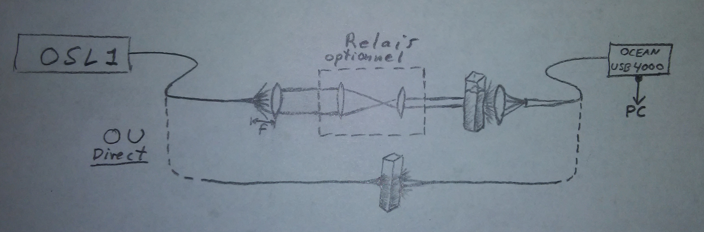

## Séance de laboratoire - Prototype du système d'aide au nettoyage

### But

Développer le prototype, préparer les échantillons de différentes concentrations et obtenir le spectre en transmission par lumière blanche de chaque solution afin de trouver une métrique unique pour chacun.

### Préparation

***1. Spectre d'émission de la source LED - Thorlabs OSL1***

[Source](https://www.thorlabs.com/catalogpages/V21/1366.PDF)

***2. Charactéristiques du spectromètre USB4000***

Réponse sur un spectre de 200-1100 nm.

Lecture sur 16 bit.

Entrée est fibrée.

***3. Liste des pics importants du spectre de la lampe au mercure***

[Liste complète des pics du spectre](http://njsas.org/projects/atoms/spectral_lines/1/mercury_nist.html)

***4. Spectre de transmission attendu pour le lait***

***5. Spectre de transmission attendu pour l'eau***

***6. Spectre de transmission attendu pour la caustique***

### Matériel

##### Matériel à se procurer

- Lait, caustique

##### Matériel disponible au laboratoire

- Ocean Optics USB Spectrometer
- Interface au spectromètre (OceanView ? software CD). 
- Lentilles
- Éprouvettes rectangulaires avec support styromousse
- Lampe au mercure
- Lampe blanche Thorlabs OSL1

### Montage

La pertinence des lentilles sera évaluée en laboratoire. La DEL et le spectromètre peuvent être rapprochés de l'échantillon afin de perdre moins de lumière et ne pas utiliser de lentilles. 

### Protocole

- Préparer les échantillons

  - Noter le volume en ml de remplissage désiré pour les éprouvettes.

  - Préparer les 6 échantillons:

    - Eau. Lait. Caustique. Eau-Lait (50-50)%. Lait-Caustique (50-50)%. Caustique-Eau (50-50)%.

    > Possible aussi de tester un plus grand éventail de concentrations, par exemple, [%caustique début: fin: bond] pour les deux mélange: $[0:10:2]$, $[10:90:20]$, $[90: 100 :2]$. 

- Monter le circuit optique

  > Tester la nécessité du confinement de la lumière DEL à l'aide de lentilles.

- Calibrer le spectromètre avec la lampe au mercure

- Obtenir le spectre de la lumière blanche seule (sans échantillon).

- Obtenir le spectre en transmission par lumière blanche sur un échantillon vide.

- Obtenir le spectre en transmission par lumière blanche des 6 échantillons préparés.

