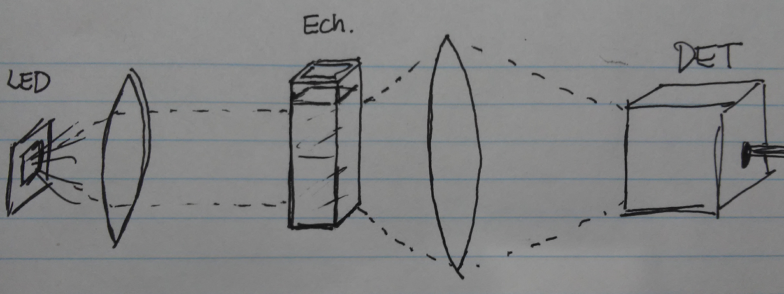

## Séance de laboratoire - Prototype du système d'aide au nettoyage

### But

Développer le prototype, préparer les échantillons de différentes concentrations et obtenir le spectre en transmission par lumière blanche de chaque solution afin de trouver une métrique unique pour chacun.

### Montage

La pertinence des lentilles sera évaluée en laboratoire. La DEL et le spectromètre peuvent être rapprochés de l'échantillon afin de perdre moins de lumière et ne pas utiliser de lentilles. 

### Matériel

##### Matériel à se procurer

- Lait, caustique
- DEL (avec l'électronique nécessaire à son fonctionnement)
- Interface au spectromètre. 

##### Matériel disponible au laboratoire

- Ocean Optics USB Spectrometer
- Lentilles
- Éprouvettes rectangulaires avec support styromousse

### Protocole

- Préparer les échantillons

  - Noter le volume en ml de remplissage désiré pour les éprouvettes.

  - Préparer les 6 échantillons:

    - Eau. Lait. Caustique. Eau-Lait (50-50)%. Lait-Caustique (50-50)%. Caustique-Eau (50-50)%.

    > Possible aussi de tester un plus grand éventail de concentrations, par exemple, [%caustique début: fin: bond] pour les deux mélange: $[0:10:2]$, $[10:90:20]$, $[90:100:2]$. 

- Monter le circuit optique

  > Tester la nécessité du confinement de la lumière DEL à l'aide de lentilles.

- Obtenir le spectre de la lumière blanche seule (sans échantillon).

- Obtenir le spectre en transmission par lumière blanche sur un échantillon vide.

- Obtenir le spectre en transmission par lumière blanche des 6 échantillons préparés.

