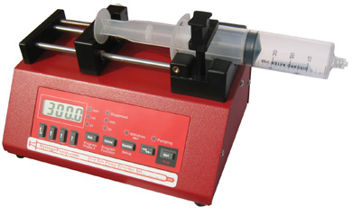

# Système d'assistance au nettoyage des conduits

### But

Reconnaître la composition du mélange présent à l'intérieur des conduits en temps réel afin de mieux identifier les différentes phases du nettoyage et ainsi optimiser le processus. . 

### Prototype

- **Développer un système simple d'interrogation optique par absorption.**

  - Source DEL blanche

    > Il peut être nécessaire de placer la DEL près de l'échantillon ou contenir la lumière en la collimant à l'aide de lentilles.

  - Éprouvettes rectangulaires en verre

    > Disponibles dans le laboratoire de TPOB.

  - Produits: lait, caustique, eau.

    > Il faudrait confirmer la composition du mélange caustique afin de se procurer le bon produit. Il peut être pertinent de se procurer différents pourcentages de lait.

  - Préparer différents échantillons de mélanges. 

    > Différentes concentrations de mélanges caustique-eau et caustique-lait. Pour ces deux mélanges, il faudrait tester différents rapports afin d'obtenir un étalonnage. Il serait pertinent de tester plus de mélanges près de la transition (caustique 100% et 0%). 

  - Spectromètre

    > Ocean Optics USB Spectrometer (disponible au labo)
    >
    > Focaliser la lumière transmise diffuse sur le capteur ?

- **Caractériser les différents mélanges: Lait -> Caustique -> Eau.**

  - Obtenir les spectres de transmission en lumière blanche des différents mélanges possibles.

- **Obtenir une métrique unique pour chacun**

  - Analyser les spectres en transmission des solutions afin de trouver une métrique unique pour chacun. 

**BUDGET: **La plupart des composantes nécessaires pour ce prototype sont déjà disponibles ou peu dispendieuses.

Pour faire un prototype de système avec circulation (si nécessaire), Daniel a une petite pompe simple qui ressemble à celle-la:

